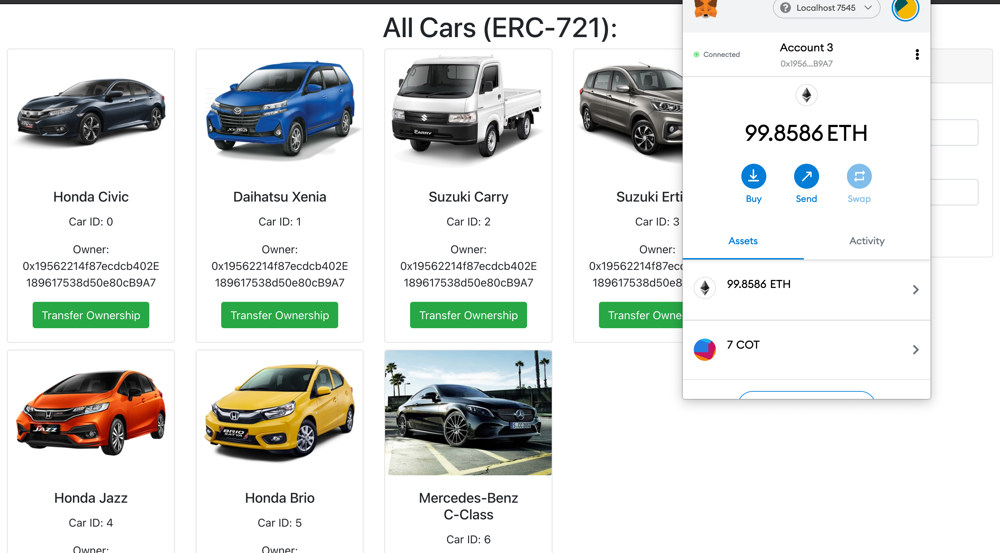
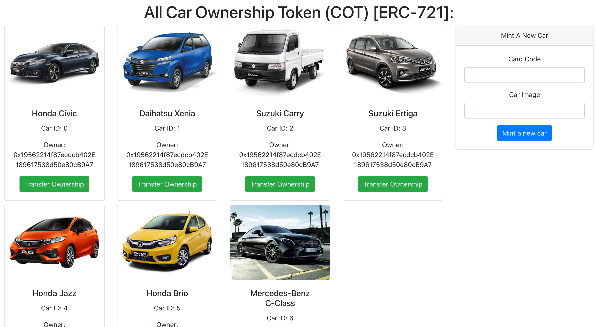

# Getting Started with Car Ownership Token ERC721

Sample project for creating custom token on top of ethereum using ERC721 standard.

## How to run the project

1. Run Ganache locally
2. Build th contracts in the `src/car-ownership-contract` by running `truffle compile`
3. Initialize the contract to Ganache by going to `src/src/car-ownership-contract` and running `truffle migrate`
4. Copy the address and port of ganache started to `src/utils/index.js` in the `HttpProvider` part
5. Start serving the UI by running `yarn start`
6. Go to `http://localhost:3000` and connect your test account in metamask with the page (better if the contract owner account is used so that you can mint another car information)

## Available Scripts

In the project directory, you can run:

### `yarn start`

Runs the app in the development mode.\
Open [http://localhost:3000](http://localhost:3000) to view it in the browser.

The page will reload if you make edits.\
You will also see any lint errors in the console.

### `yarn test`

Launches the test runner in the interactive watch mode.\
See the section about [running tests](https://facebook.github.io/create-react-app/docs/running-tests) for more information.

### `yarn build`

Builds the app for production to the `build` folder.\
It correctly bundles React in production mode and optimizes the build for the best performance.

The build is minified and the filenames include the hashes.\
Your app is ready to be deployed!

See the section about [deployment](https://facebook.github.io/create-react-app/docs/deployment) for more information.
